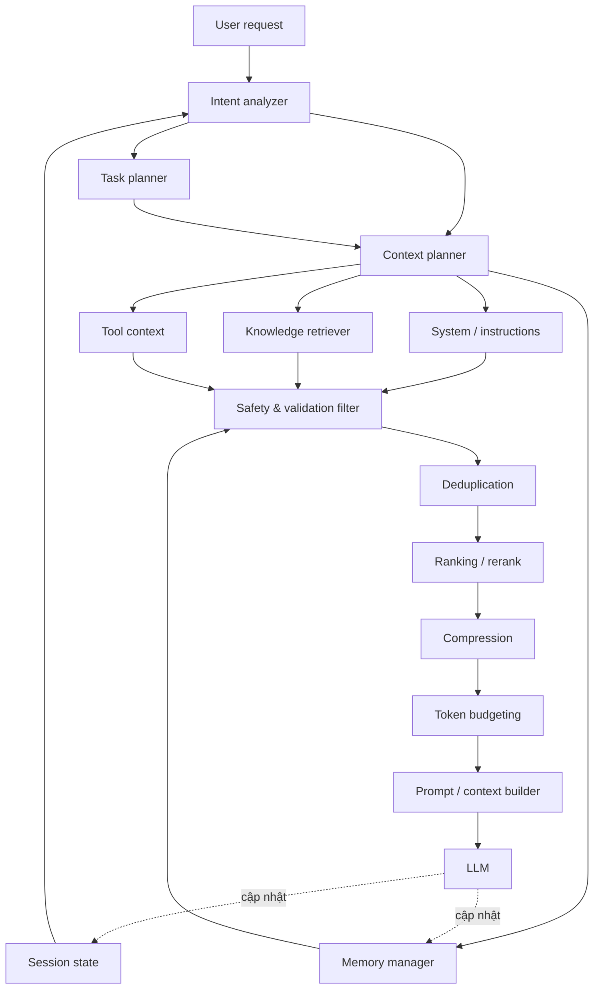

# Kế hoạch triển khai Context Assembler

> Tài liệu này mô tả kiến trúc đã hiệu chỉnh và kế hoạch triển khai chi tiết theo từng giai đoạn (phase) cho project **Context Assembler** — hệ thống lắp ráp ngữ cảnh (context assembly) cho một ứng dụng LLM/agent.

---

## 0. Kiến trúc tổng quan đã hiệu chỉnh



### Những điểm đã sửa so với sơ đồ gốc

| # | Vấn đề trong sơ đồ gốc | Sửa lại |
|---|---|---|
| 1 | Không có vòng lặp phản hồi (feedback loop) — pipeline một chiều, LLM không ghi lại gì | Thêm cạnh phản hồi: kết quả LLM cập nhật lại `Session State` (lượt hội thoại) và `Memory Manager` (tri thức dài hạn) |
| 2 | `Session State` chỉ song song với `Task Planner`, không phải đầu vào của `Intent Analyzer` | `Session State` phải là đầu vào trực tiếp của `Intent Analyzer` — cần lịch sử hội thoại để giải quyết đồng tham chiếu (coreference), tỉnh lược (ellipsis), ý định phụ thuộc ngữ cảnh |
| 3 | Thiếu hoàn toàn nguồn **System / Instruction Context** (system prompt, few-shot, tool schema tĩnh) | Thêm `System / Instructions` như một nguồn song song với Knowledge Retriever, Memory Manager, Tool Context |
| 4 | Thiếu bước **Safety & Validation** (chống prompt injection gián tiếp từ tài liệu/tool output, redact PII) | Thêm `Safety & Validation Filter` ngay sau khi thu thập ngữ cảnh, trước khi bất kỳ nội dung nào được rerank hay đưa vào prompt |
| 5 | Thứ tự `Context Ranking → Context Deduplication` chưa tối ưu | Đổi thành `Deduplication → Ranking`: loại trùng lặp trước để không lãng phí compute rerank (đặc biệt nếu dùng cross-encoder/LLM-based reranker) trên các chunk trùng nhau |
| 6 | `Tool State` mơ hồ — không rõ là schema tĩnh hay kết quả gọi tool động | Tách rõ: schema/định nghĩa tool nằm trong `System / Instructions` (tĩnh), kết quả tool call gần nhất nằm trong `Tool Context` (động) |
| 7 | Không phân biệt **Static Context** (ít đổi) và **Dynamic Context** (đổi mỗi request) | `Prompt/Context Builder` cần sắp thứ tự: phần tĩnh (system, tool schema) đặt trước để tận dụng prompt caching, phần động (retrieval, memory, history) đặt sau |
| 8 | Thiếu lớp cache | Thêm caching ở tầng retrieval (embedding cache) và tầng prompt (prompt/prefix caching) — chi tiết ở Phase 6 |

---

## Phase 0 — Xác định phạm vi & yêu cầu (1 tuần)

**Mục tiêu:** Chốt use case, ràng buộc kỹ thuật, và tiêu chí thành công trước khi code.

**Công việc cần làm:**
- Xác định loại ứng dụng: chatbot đơn giản, RAG Q&A, hay agent đa bước có gọi tool.
- Xác định các nguồn ngữ cảnh thực sự cần dùng (tài liệu nội bộ? lịch sử hội thoại dài hạn? tool nào?).
- Xác định LLM mục tiêu (model nào, context window bao nhiêu token) vì điều này quyết định chiến lược token budgeting.
- Định nghĩa SLA: độ trễ tối đa cho việc lắp ráp ngữ cảnh (context assembly latency), ví dụ < 500ms.

**Cách thực hiện:**
- Viết 5–10 câu hỏi/mẫu hội thoại thật (golden set) đại diện cho các tình huống khó: câu hỏi mơ hồ cần session state, câu hỏi cần nhiều nguồn tri thức, câu hỏi cần gọi tool.
- Từ golden set, suy ra schema dữ liệu cho từng thành phần (Session State, Memory, Knowledge base).

**Deliverables:** Tài liệu yêu cầu (1 trang), golden set (10–20 mẫu), sơ đồ kiến trúc đã chốt (như Phase 0 ở trên).

**Sau khi thực hiện:**
#### 1. Phạm vi
- Dạng tài liệu: PDF (Tài liệu trong thư mục data ở thư mục gốc).
- Ngôn ngữ: Tiếng Việt và Tiếng Anh.
- Chức năng chính: Hỏi đáp, tóm tắt, tra cứu kèm trích dẫn số trang và tên file.
#### 2. Tiêu chí thành công (SLA & Metrics)
- Trích dẫn chính xác số trang ≥ 90% các câu hỏi fact.
- Không tự bịa thông tin khi tài liệu không đề cập (Zero-hallucination trên câu hỏi ngoài phạm vi).
- Độ trễ lắp ráp context (truy xuất PDF + lịch sử chat + prompt): < 600ms.
#### 3. Dữ liệu & Cấu trúc Metadata của Chunk
Mỗi đoạn văn bản (chunk) trích ra từ PDF sẽ lưu các thông tin:
```
{ 
    "content": "Nội dung văn bản...", 
    "doc_name": "Huong_dan_su_dung.pdf", 
    "page_number": 12, 
    "chunk_id": "doc_12_chunk_3" 
}
```
#### 4. Tech Stack qua các Phase

| Thành phần | Lựa chọn tham khảo trong Plan |
| :--- | :--- |
| **Embedding model** | BGE-M3 / multilingual-e5 (hỗ trợ tiếng Việt/Anh tốt), hoặc API Embedding có sẵn |
| **Vector DB** | pgvector / SQLite-vec (khi làm prototype) → Qdrant / Milvus (khi lên production) |
| **Keyword search (BM25) + Vector search** | Thư viện rank-bm25 (gọn nhẹ) hoặc Elasticsearch / OpenSearch |
| **Reranker** | bge-reranker hoặc Cohere rerank |
| **Compression (Nén context)** | LLMLingua / LLMLingua-2 |
| **Safety & PII Filter** | Microsoft Presidio + Rule-based regex |
| **Session & Memory** | Redis (cho session ngắn hạn) + Vector Store riêng (cho memory dài hạn), hoặc dùng thư viện Zep / Mem0 |
| **Orchestration (Điều phối)** | LangGraph, hoặc tự viết pipeline dạng function chain (chủ động kiểm soát) |
| **Observability (Giám sát)** | OpenTelemetry (tracing), Langfuse / Phoenix (theo dõi token & LLM) |

---

## Phase 1 — Chuẩn bị dữ liệu & Knowledge Base

**Mục tiêu:** Có một kho tri thức có thể truy xuất được, chất lượng chunk tốt.

**Công việc cần làm:**
1. Thu thập & làm sạch tài liệu nguồn.
2. Thiết kế chiến lược chunking (theo đoạn, theo section, hoặc semantic chunking).
3. Chọn embedding model và xây index vector.
4. (Tuỳ chọn) Xây thêm index từ khoá (BM25) để hybrid search.

**Cách thực hiện:**
- Chunking: bắt đầu với chunk size 300–500 token, overlap 10–15%; với tài liệu có cấu trúc (Markdown/HTML) nên chunk theo heading để giữ ngữ nghĩa trọn vẹn.
- Embedding model: nếu cần đa ngôn ngữ (tiếng Việt + tiếng Anh) ưu tiên các model dạng multilingual E5 hoặc BGE-M3; nếu chỉ tiếng Anh có thể dùng embedding của nhà cung cấp API đang dùng.
- Vector DB: chọn theo quy mô — pgvector/SQLite-vec cho prototype, Qdrant/Milvus cho production cần filter phức tạp và scale lớn.
- Hybrid search: kết hợp BM25 (keyword) + vector search, gộp điểm bằng reciprocal rank fusion (RRF) để tăng recall.
- Gắn metadata cho mỗi chunk: nguồn, thời gian cập nhật, độ tin cậy — dùng để lọc và xếp hạng sau này.

**Deliverables:** Pipeline ingestion có thể chạy lại (idempotent), vector index + keyword index, script đánh giá chất lượng chunk (retrieval recall@k trên golden set).

---

## Phase 2 — Session & Memory Layer

**Mục tiêu:** Xây "Session State" (ngắn hạn) và "Memory Manager" (dài hạn) làm nền tảng ngữ cảnh hội thoại.

**Công việc cần làm:**
1. Session State: lưu buffer các lượt hội thoại gần nhất (raw hoặc đã tóm tắt).
2. Memory Manager: lưu trữ tri thức dài hạn về người dùng/miền (facts, sở thích, quyết định trước đó).
3. Cơ chế ghi (write-back) sau mỗi lượt LLM phản hồi.

**Cách thực hiện:**
- Session State: dùng buffer trượt (sliding window) theo số lượt hoặc số token; khi vượt ngưỡng, tóm tắt các lượt cũ thành 1 đoạn ngắn (rolling summary) thay vì giữ nguyên văn.
- Memory Manager: tách 2 loại — bộ nhớ dạng fact có cấu trúc (key-value hoặc bảng) và bộ nhớ dạng tự do (embedding trong vector store riêng, khác với knowledge base sản phẩm).
- Ghi vào memory: sau khi LLM trả lời, chạy một bước trích xuất (có thể dùng LLM nhỏ/rẻ) để quyết định có fact mới nào cần lưu không — tránh lưu mọi thứ một cách mù quáng.
- Cân nhắc dùng thư viện có sẵn (ví dụ Zep, Mem0) nếu không muốn tự xây từ đầu.

**Deliverables:** API `get_session_state(conversation_id)`, `get_memory(user_id, query)`, `write_memory(...)`; test kiểm tra memory được cập nhật đúng sau một lượt hội thoại mẫu.

---

## Phase 3 — Intent Analyzer & Planning Layer

**Mục tiêu:** Hiểu đúng ý định người dùng (có dùng session state) và lập kế hoạch cần lấy những loại ngữ cảnh nào.

**Công việc cần làm:**
1. Intent Analyzer: nhận `User Request` + `Session State`, xuất ra intent có cấu trúc (loại tác vụ, thực thể, câu hỏi đã viết lại nếu có đồng tham chiếu).
2. Task Planner: quyết định loại tác vụ cần công cụ gì (trả lời trực tiếp, cần tra cứu, cần gọi tool, cần nhiều bước).
3. Context Planner: từ intent + task, sinh ra danh sách truy vấn con (sub-queries) cho từng nguồn (Knowledge Retriever cần query gì, Memory cần lấy loại fact gì, Tool cần gọi gì).

**Cách thực hiện:**
- Dùng một lời gọi LLM nhẹ (model nhỏ/nhanh) với structured output (JSON schema) để sinh intent + sub-queries, tránh phải viết rule-based phức tạp.
- Với câu hỏi có đại từ/tỉnh lược ("nó", "cái đó"), dùng session state để viết lại câu hỏi đầy đủ (query rewriting) trước khi đưa sang Context Planner.
- Với tác vụ đa bước (multi-hop), Context Planner có thể sinh nhiều sub-query thay vì 1 câu truy vấn duy nhất.

**Deliverables:** Module `intent_analyzer` + `context_planner` trả về object có cấu trúc rõ ràng (ví dụ: `{intent, rewritten_query, needed_sources: [...], sub_queries: [...]}`).

---

## Phase 4 — Context Retrieval Layer (song song)

**Mục tiêu:** Thu thập ứng viên ngữ cảnh từ 4 nguồn song song theo kế hoạch ở Phase 3.

**Công việc cần làm:**
1. Knowledge Retriever: hybrid search trên vector + keyword index (từ Phase 1).
2. Memory Manager: truy xuất fact/bộ nhớ liên quan (từ Phase 2).
3. Tool Context: lấy schema các tool khả dụng + kết quả gọi tool gần nhất (nếu có).
4. System / Instructions: system prompt, guidelines, few-shot examples — phần tĩnh, thường lấy từ config chứ không cần truy xuất động.

**Cách thực hiện:**
- Gọi 4 nguồn này song song (async/parallel) để giảm độ trễ tổng — đây là bước tốn thời gian nhất trong pipeline nếu chạy tuần tự.
- Over-fetch: lấy nhiều hơn số lượng cần dùng cuối cùng (ví dụ top 30–50 candidate) vì các bước sau (dedup, rank) sẽ lọc lại.
- Áp dụng cache: cache kết quả embedding của các câu hỏi lặp lại, cache kết quả retrieval trong một khoảng thời gian ngắn nếu truy vấn giống hệt.

**Deliverables:** Hàm `retrieve_all(context_plan) -> List[ContextCandidate]` chạy song song, có timeout riêng cho từng nguồn để một nguồn chậm không làm treo toàn bộ pipeline.

---

## Phase 5 — Context Processing Pipeline (đã sắp xếp lại)

**Mục tiêu:** Biến tập ứng viên thô thành ngữ cảnh sạch, an toàn, vừa vặn ngân sách token.

**Thứ tự đã hiệu chỉnh:** `Safety & Validation → Deduplication → Ranking/Rerank → Compression → Token Budgeting`

### 5.1 Safety & Validation Filter
- Quét nội dung lấy từ Knowledge Retriever / Tool Context để phát hiện các mẫu prompt injection gián tiếp (chỉ dẫn ẩn trong tài liệu/kết quả tool nhằm thay đổi hành vi của LLM).
- Redact thông tin nhạy cảm/PII trước khi đi tiếp (ví dụ dùng Presidio hoặc regex + NER cho các định dạng chuẩn).
- Đây là bước đầu tiên trong pipeline xử lý vì mọi bước sau (đặc biệt nếu dùng LLM-based reranker) cũng phải tránh "đọc" nội dung độc hại chưa được lọc.

### 5.2 Deduplication
- Loại các chunk gần giống nhau (near-duplicate) bằng cosine similarity trên embedding hoặc MinHash, ngưỡng ví dụ > 0.92 coi là trùng.
- Làm bước này trước ranking để không lãng phí compute rerank (vốn đắt) trên nội dung dư thừa.

### 5.3 Ranking / Rerank
- Dùng cross-encoder reranker (ví dụ bge-reranker, Cohere rerank) để chấm điểm lại độ liên quan của từng candidate với câu hỏi đã viết lại ở Phase 3.
- Kết hợp điểm rerank với metadata (độ mới, độ tin cậy nguồn) nếu cần trọng số bổ sung.

### 5.4 Compression
- Với các chunk dài nhưng chỉ liên quan một phần, dùng kỹ thuật nén ngữ cảnh (ví dụ LLMLingua, hoặc tóm tắt trích xuất) để giữ lại phần thông tin cốt lõi, giảm số token mà không mất ý chính.
- Chỉ nén các chunk có điểm rank thấp hơn ngưỡng "giữ nguyên văn" — các chunk quan trọng nhất nên giữ nguyên để tránh mất chi tiết.

### 5.5 Token Budgeting
- Phân bổ ngân sách token cố định cho từng loại ngữ cảnh, ví dụ: system/instructions 10%, tool context 10%, memory 15%, knowledge 45%, session history 20% (tỷ lệ cần tinh chỉnh theo use case thực tế).
- Cắt bớt theo thứ tự ưu tiên (điểm rank) trong mỗi nhóm cho đến khi vừa ngân sách, không cắt ngẫu nhiên.

**Deliverables:** Module `process_context(candidates) -> ContextBundle` với từng bước là một hàm độc lập, có thể bật/tắt và đo thời gian riêng (quan trọng cho việc tối ưu sau này).

---

## Phase 6 — Prompt / Context Builder & Caching

**Mục tiêu:** Lắp ráp `ContextBundle` thành prompt cuối cùng, tối ưu cho cache và đúng định dạng model yêu cầu.

**Công việc cần làm:**
1. Định nghĩa template lắp ráp: thứ tự các phần trong prompt.
2. Tách phần tĩnh và phần động để tận dụng prompt/prefix caching.
3. Format đúng theo API của LLM đang dùng (system message, tool definitions, message list).

**Cách thực hiện:**
- Thứ tự khuyến nghị trong prompt: (1) system/instructions + tool schema (tĩnh, đặt đầu để cache) → (2) tri thức đã xử lý từ Knowledge Retriever → (3) memory/fact liên quan → (4) lịch sử hội thoại gần nhất (session state) → (5) câu hỏi hiện tại của người dùng.
- Nếu LLM/API hỗ trợ prompt caching (đánh dấu prefix cố định), đảm bảo phần tĩnh không đổi giữa các request để tận dụng cache, giảm chi phí và độ trễ.
- Log lại toàn bộ prompt đã build (có thể redact phần nhạy cảm) để phục vụ debugging và audit.

**Deliverables:** Hàm `build_prompt(context_bundle, user_query) -> PromptPayload`, unit test kiểm tra thứ tự và giới hạn token đầu ra.

---

## Phase 7 — LLM Integration & Feedback Loop

**Mục tiêu:** Gọi LLM và đóng vòng lặp cập nhật memory/session — phần còn thiếu hoàn toàn trong sơ đồ gốc.

**Công việc cần làm:**
1. Gọi LLM với prompt đã build, xử lý streaming nếu cần.
2. Parse output (text thường hoặc tool call).
3. Ghi lượt hội thoại mới vào Session State.
4. Trích xuất fact mới (nếu có) để ghi vào Memory Manager.
5. Nếu output là tool call, thực thi tool và đưa kết quả trở lại vòng lặp (đưa vào Tool Context ở lượt tiếp theo).

**Cách thực hiện:**
- Việc trích xuất fact để ghi memory nên dùng một lời gọi LLM riêng, nhỏ và rẻ, chạy bất đồng bộ (không chặn phản hồi cho người dùng).
- Với agent nhiều bước, vòng lặp Tool Context → LLM → Tool call → Tool Context có thể lặp lại vài lần trước khi trả lời cuối cùng cho người dùng — cần giới hạn số bước lặp tối đa để tránh vòng lặp vô hạn.

**Deliverables:** Vòng lặp end-to-end chạy được từ `User Request` đến phản hồi cuối, có ghi lại session/memory, kèm giới hạn số bước lặp.

---

## Phase 8 — Evaluation & Observability

**Mục tiêu:** Đo lường chất lượng và chi phí của pipeline một cách có hệ thống, không chỉ "nhìn bằng mắt".

**Công việc cần làm:**
1. Đo chất lượng retrieval: recall@k, precision@k trên golden set (Phase 0).
2. Đo chất lượng ngữ cảnh cuối: tỷ lệ context thực sự được dùng trong câu trả lời (context relevance/utilization).
3. Đo hiệu năng hệ thống: độ trễ từng bước (retrieval, rerank, compression, build), tổng độ trễ end-to-end, chi phí token trung bình mỗi request.
4. Theo dõi tỷ lệ ảo giác (hallucination rate) khi có/không có ngữ cảnh đúng.

**Cách thực hiện:**
- Ghi log có cấu trúc (structured logging) cho mỗi bước trong pipeline, gắn trace ID xuyên suốt một request để dễ debug.
- Dùng một bộ câu hỏi test cố định, chạy lại định kỳ (regression test) mỗi khi thay đổi pipeline để phát hiện suy giảm chất lượng.
- Cân nhắc dùng LLM-as-judge cho các tiêu chí khó đo tự động (độ liên quan, độ đầy đủ của câu trả lời), kết hợp với các số liệu retrieval có thể đo chính xác.

**Deliverables:** Dashboard/báo cáo theo dõi các chỉ số trên, bộ test regression chạy tự động trong CI.

---

## Phase 9 — Optimization, Scaling & Deployment

**Mục tiêu:** Đưa hệ thống vào vận hành ổn định, tối ưu chi phí/độ trễ ở quy mô thực tế.

**Công việc cần làm:**
1. Tối ưu độ trễ: song song hoá tối đa các bước độc lập, cache ở nhiều tầng (embedding, retrieval, prompt).
2. Tối ưu chi phí: giảm số lời gọi LLM phụ (intent analyzer, memory extraction) bằng model nhỏ/rẻ hơn khi có thể.
3. Thiết lập giới hạn tải (rate limiting), retry, và fallback khi một nguồn ngữ cảnh bị lỗi/timeout (ví dụ: nếu Knowledge Retriever timeout, vẫn tiếp tục với các nguồn còn lại thay vì fail toàn bộ).
4. Triển khai theo môi trường (staging → production), giám sát theo Phase 8 liên tục sau khi lên production.

**Cách thực hiện:**
- Thiết kế mỗi bước trong pipeline là một service/module độc lập có thể scale riêng (đặc biệt Knowledge Retriever và Reranker vốn tốn tài nguyên nhất).
- Đặt timeout + graceful degradation cho từng nguồn ở Phase 4 — ưu tiên trả lời kịp thời hơn là chờ đủ mọi nguồn.
- Định kỳ review lại tỷ lệ phân bổ token (Phase 5.5) và ngưỡng dedup/rerank dựa trên số liệu thực tế thu thập ở Phase 8.

**Deliverables:** Hệ thống chạy production có giám sát, tài liệu vận hành (runbook) cho các lỗi thường gặp (timeout nguồn dữ liệu, vượt ngân sách token, phát hiện injection).

---

## Gợi ý tech stack tổng hợp

| Thành phần | Lựa chọn tham khảo |
|---|---|
| Embedding model | BGE-M3 / multilingual-e5 (đa ngôn ngữ), hoặc embedding API đang dùng sẵn |
| Vector DB | pgvector/SQLite-vec (prototype) → Qdrant/Milvus (production) |
| Keyword search | BM25 (Elasticsearch/OpenSearch, hoặc thư viện rank-bm25 cho quy mô nhỏ) |
| Reranker | bge-reranker, Cohere rerank |
| Compression | LLMLingua / LLMLingua-2 |
| PII/safety filter | Microsoft Presidio + rule-based cho định dạng đặc thù |
| Session/Memory | Tự xây trên Redis (session) + vector store riêng (memory), hoặc dùng Zep/Mem0 |
| Orchestration | LangGraph, hoặc tự viết pipeline dạng function chain nếu muốn kiểm soát tối đa |
| Observability | OpenTelemetry cho tracing, Langfuse/Phoenix cho LLM-specific tracing |

## Tiêu chí thành công tổng thể

- Retrieval recall@10 ≥ ngưỡng đặt ra trên golden set (Phase 0).
- Độ trễ end-to-end của bước lắp ráp ngữ cảnh (không tính thời gian sinh của LLM) nằm trong SLA đã chốt.
- Không có trường hợp injection từ tài liệu retrieved lọt qua Safety & Validation Filter trong bộ test đối kháng (adversarial test set).
- Chi phí token trung bình mỗi request nằm trong ngân sách đã tính toán ở Phase 5.5.
