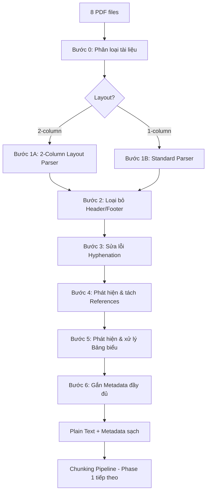

# Chiến lược Tiền xử lý Dữ liệu — Phase 1: Knowledge Base

> Tài liệu này trình bày chiến lược tiền xử lý tối ưu cho 8 tệp PDF trong thư mục `data/`, dựa trên phân tích thực tế về cấu trúc, layout, và đặc tính nội dung của từng tài liệu.

---

## 1. Bức tranh tổng quan Dữ liệu

### 1.1 Danh mục tài liệu

| # | Tên file | Pages | Layout | TOC | Ref trang | Math | Bảng | Ngôn ngữ | Nhóm |
|---|---|---|---|---|---|---|---|---|---|
| 1 | `Attention is all you need.pdf` | 15 | **2 cột** | 22 mục | Trang 10–15 | 4/15 | **5/15** | EN | Paper |
| 2 | `Attention Mechanism...pdf` | 22 | **1 cột** | 6 mục | Trang 18–22 | 3/22 | 0/22 | EN | Survey |
| 3 | `DeepLearning.pdf` | **414** | **1 cột** | **259 mục** | Trang 414 | **155/414** | 4/414 | **VI** (113 dấu/3tr) | Sách |
| 4 | `DeepSeek Paper.pdf` | 86 | **1 cột** | 61 mục | Trang 79–86 | 7/86 | **22/86** | EN | Paper |
| 5 | `Expanding Vietnamese SentiWordNet.pdf` | 8 | **2 cột** | ❌ không có | Trang 7–8 | 2/8 | 1/8 | EN | Paper |
| 6 | `Generative-Adversarial-Nets (GAN).pdf` | 9 | **2 cột** | ❌ không có | Trang 8–9 | 3/9 | 2/9 | EN | Paper |
| 7 | `Lora paper.pdf` | 26 | **2 cột** | 37 mục | Trang 13–26 | **19/26** | **14/26** | EN | Paper |
| 8 | `Machine Learning Yearning.pdf` | 127 | **1 cột** | 80 mục | ❌ không có | 5/127 | 18/127 | **VI** (395 dấu/3tr) | Sách |

### 1.2 Phân loại theo nhóm xử lý

```
Nhóm A — Bài báo 2 cột (4 files)
├── Attention is all you need.pdf
├── Expanding Vietnamese SentiWordNet.pdf
├── Generative-Adversarial-Nets (GAN).pdf
└── Lora paper.pdf

Nhóm B — Báo cáo / Survey 1 cột (2 files)
├── Attention Mechanism in Neural Networks.pdf
└── DeepSeek Paper.pdf

Nhóm C — Sách giáo trình dài (2 files)
├── DeepLearning.pdf          (414 trang — Tiếng Việt)
└── Machine Learning Yearning.pdf (127 trang — Tiếng Việt)
```

---

## 2. Các Thách thức Cụ thể đã Xác định

### 2.1 Nhóm A — Bài báo 2 cột

> [!WARNING]
> **Thách thức #1: Sai thứ tự đọc (Reading Order)**  
> PyMuPDF dọc text theo y-coordinate theo trang, khiến dòng Cột 1 và Cột 2 xen lẫn nhau:  
> `"... neural networks [1] Multi-head attention allows..."` — không mạch lạc.

> [!CAUTION]
> **Thách thức #2: GAN.pdf và SentiWordNet.pdf không có TOC**  
> Không thể dùng TOC để xác định ranh giới section, phải dùng font-size heuristics để nhận diện tiêu đề.

**Thách thức #3: References section (chiếm 2–3 trang cuối)**  
Danh sách tài liệu tham khảo chứa dày đặc từ khóa ML nhưng không mang giá trị trả lời. Nếu đưa vào index sẽ gây false positive rất cao khi tìm kiếm.

### 2.2 Nhóm B — Báo cáo / Survey 1 cột

**Thách thức #4: DeepSeek Paper (86 trang) có Appendix dày**  
Phần phụ lục (Appendix A–F) chứa kết quả chi tiết, mã giả (pseudo-code GRPO), và bảng benchmark. Cần xử lý Appendix như một "zone" riêng biệt với metadata đặc biệt.

**Thách thức #5: Từ bị ngắt dòng bằng gạch nối**  
```
"auto-regres-\nsive" → cần ghép thành "autoregressive"  
"represen-\ntation" → cần ghép thành "representation"
```

### 2.3 Nhóm C — Sách giáo trình Tiếng Việt

> [!IMPORTANT]
> **Thách thức #6: DeepLearning.pdf (414 trang) dịch từ tiếng Anh**  
> Chứa hỗn hợp tiếng Việt + thuật ngữ tiếng Anh không dịch (ReLU, backpropagation, overfitting).  
> Embedding model **bắt buộc** phải hỗ trợ multilingual.

**Thách thức #7: Thuật ngữ số học & ký hiệu toán học**  
Nhiều công thức (∑, ∂, ∇, √) và ký hiệu đặc biệt bị mã hóa sai hoặc rã vỡ khi extract text.

**Thách thức #8: Machine Learning Yearning — 57 chương cực ngắn**  
Mỗi chương chỉ dài 1–2 trang (~300–500 từ). Cắt theo chunk-size cố định sẽ gây xé đôi giữa 2 chương.

---

## 3. Pipeline Tiền xử lý — Thiết kế Tổng thể



---

## 4. Chi tiết Từng Bước Xử lý

### Bước 0: Phân loại tài liệu tự động

Tự động nhận dạng layout dựa vào tọa độ block:

```python
def classify_layout(pdf_path: str) -> str:
    doc = fitz.open(pdf_path)
    # Kiểm tra trang 2 (tránh trang title)
    page = doc[min(1, len(doc)-1)]
    width = page.rect.width
    x_mid = width / 2.0
    blocks = [b for b in page.get_text("blocks") if b[4].strip()]
    
    left  = [b for b in blocks if b[2] <= x_mid + 30]
    right = [b for b in blocks if b[0] >= x_mid - 30]
    
    return "2-column" if (len(left) >= 2 and len(right) >= 2) else "1-column"
```

**Quy tắc phân loại file vào nhóm:**

| Điều kiện | Nhóm |
|---|---|
| layout == "2-column" | Nhóm A |
| layout == "1-column" AND pages > 80 AND TOC > 50 | Nhóm C (Sách) |
| layout == "1-column" AND pages ≤ 80 | Nhóm B (Survey/Paper) |

---

### Bước 1A: 2-Column Layout Parser *(Áp dụng cho Nhóm A)*

**Vấn đề cốt lõi:** PyMuPDF mặc định sắp xếp blocks theo `y0` (top-to-bottom), không theo column. 

**Giải pháp:** Tách page thành 2 vùng theo trục X, đọc trọn vẹn Cột trái trước, rồi mới đến Cột phải.

```python
def extract_two_column_page(page) -> str:
    width = page.rect.width
    x_mid = width / 2.0
    blocks = page.get_text("blocks")
    
    # Chỉ lấy text blocks (block_type == 0)
    text_blocks = [b for b in blocks if b[6] == 0 and b[4].strip()]
    
    # Tách 2 cột theo x_mid với buffer ±20pt
    left_col  = sorted([b for b in text_blocks if b[2] <= x_mid + 20], key=lambda b: b[1])
    right_col = sorted([b for b in text_blocks if b[0] >= x_mid - 20], key=lambda b: b[1])
    
    # Đọc Cột trái trước, rồi Cột phải
    all_text = "\n\n".join(
        b[4].strip() for b in (left_col + right_col) if b[4].strip()
    )
    return all_text
```

> [!NOTE]
> Một số trang đặc biệt (trang Abstract, trang bìa, trang Figure full-width) cần phát hiện và xử lý như trang 1 cột. Heuristic: nếu số block `left_col` hoặc `right_col` < 2 thì fallback sang 1-column mode.

---

### Bước 1B: Standard Parser *(Áp dụng cho Nhóm B và C)*

```python
def extract_single_column_page(page) -> str:
    # Sắp xếp blocks theo y0 (top → bottom)
    blocks = sorted(page.get_text("blocks"), key=lambda b: b[1])
    text_parts = []
    
    for b in blocks:
        if b[6] != 0:  # Bỏ qua image blocks
            continue
        text = b[4].strip()
        if text:
            text_parts.append(text)
    
    return "\n\n".join(text_parts)
```

---

### Bước 2: Loại bỏ Header và Footer *(Áp dụng tất cả)*

**Quy trình 2 bước:**

**Bước 2a — Zone-based filtering** (dựa theo vị trí tọa độ y):
```python
HEADER_ZONE_PT = 50   # Top 50 points của trang
FOOTER_ZONE_PT = 50   # Bottom 50 points của trang

def is_header_or_footer(block, page_height: float) -> bool:
    y0, y1 = block[1], block[3]
    return y1 < HEADER_ZONE_PT or y0 > (page_height - FOOTER_ZONE_PT)
```

**Bước 2b — Repetition-based filtering** (bắt nội dung lặp lặp > 3 trang):
```python
from collections import Counter

def find_repeated_strings(pages_raw: list, min_pages=4) -> set:
    """Tìm chuỗi xuất hiện trên ít nhất min_pages trang (header/footer lặp lại)."""
    counter = Counter()
    for page_text in pages_raw:
        # Lấy dòng đầu và dòng cuối mỗi trang
        lines = page_text.strip().split("\n")
        for candidate in lines[:2] + lines[-2:]:
            c = candidate.strip()
            if c and len(c) > 3:
                counter[c] += 1
    return {text for text, count in counter.items() if count >= min_pages}
```

**Ví dụ thực tế cần lọc:**
- `"DeepSeek-R1: Incentivizing Reasoning Capability in LLMs via Reinforcement Learning"` — running title lặp lại trên 86 trang.
- `"2"`, `"3"`, ... — số trang độc lập (không trong câu văn).

---

### Bước 3: Sửa lỗi Hyphenation (Từ bị ngắt dòng)

PDF 2 cột đặc biệt hay xảy ra hiện tượng từ bị ngắt cuối dòng:

```python
import re

def repair_hyphenation(text: str) -> str:
    # Case 1: word- \n word (Tiếng Anh)
    # "auto-\nregressive" → "autoregressive"
    text = re.sub(r'(\w+)-\s*\n\s*([a-z])', r'\1\2', text)
    
    # Case 2: Dòng không kết thúc bằng dấu câu thì nối với dòng tiếp theo
    # (Lưu ý: không nối qua ranh giới đoạn văn — chỉ áp dụng trong cùng block)
    text = re.sub(r'([a-z,;])\n([a-z])', r'\1 \2', text)
    
    # Case 3: Tiếng Việt — thường không có hyphenation, bảo vệ xuống dòng tự nhiên
    # Không áp dụng regex trên cho Vietnamese text
    return text
```

> [!TIP]
> Với tài liệu Tiếng Việt (DeepLearning.pdf, ML Yearning.pdf), **tắt** hyphenation repair vì tiếng Việt không dùng dấu gạch nối giữa từ theo cách này.

---

### Bước 4: Phát hiện và Tách phần References

Phần References/Bibliography là "vùng cấm" — không đưa vào Knowledge Base chính.

```python
REFERENCE_HEADERS = [
    r'^\s*(References|REFERENCES)\s*$',
    r'^\s*(Bibliography|BIBLIOGRAPHY)\s*$',
    r'^\s*(TÀI LIỆU THAM KHẢO)\s*$',
]

def find_references_start(pages_text: list[str]) -> int | None:
    """Trả về page index (0-based) của trang đầu tiên chứa References."""
    for i in range(len(pages_text) - 1, -1, -1):
        for pattern in REFERENCE_HEADERS:
            if re.search(pattern, pages_text[i], re.MULTILINE):
                return i
    return None

# Trong pipeline:
ref_start = find_references_start(pages_text)
if ref_start:
    main_content = pages_text[:ref_start]        # → đưa vào Knowledge Base
    references   = pages_text[ref_start:]        # → lưu riêng, index phụ hoặc bỏ qua
```

**Kết quả thực tế từ deep inspection:**

| File | Có References | Trang thực tế (đã đo) | Tỷ lệ bị loại bỏ |
|---|---|---|---|
| Attention is all you need.pdf | ✅ | Trang **10–15** | **40%** tổng trang |
| Attention Mechanism...pdf | ✅ | Trang **18–22** | 23% tổng trang |
| DeepSeek Paper.pdf | ✅ | Trang **79–86** | 9% tổng trang |
| GAN.pdf | ✅ | Trang **8–9** | 22% tổng trang |
| LoRA paper.pdf | ✅ | Trang **13–26** | **54%** tổng trang |
| SentiWordNet.pdf | ✅ | Trang **7–8** | 25% tổng trang |
| DeepLearning.pdf | ✅ | Trang **414** (1 trang) | < 1% |
| Machine Learning Yearning | ❌ **Không có** | — | 0% |

> [!WARNING]
> **LoRA paper có 54% nội dung là References/Appendix** — đây là tỷ lệ cực cao, không lọc sẽ gây noise nghiêm trọng cho vector index.
>
> **Attention is all you need có References bắt đầu từ trang 10/15** — tức là chỉ có 9 trang nội dung thực sự hữu ích.

---

### Bước 5: Phát hiện và xử lý Bảng biểu

PyMuPDF có API `page.find_tables()` nhận diện bảng từ đường kẻ (ruling lines). Chuyển đổi sang Markdown Table để LLM đọc được:

```python
def extract_tables_as_markdown(page) -> list[dict]:
    """Trích bảng ra Markdown, kèm vị trí (để biết nên insert vào đâu trong text)."""
    results = []
    tab_finder = page.find_tables()
    
    for i, table in enumerate(tab_finder.tables):
        # Lấy dữ liệu bảng dưới dạng list of lists
        data = table.extract()
        if not data:
            continue
        
        # Build Markdown table
        header = data[0]
        md_rows = ["| " + " | ".join(str(c or "") for c in header) + " |"]
        md_rows.append("| " + " | ".join(["---"] * len(header)) + " |")
        
        for row in data[1:]:
            md_rows.append("| " + " | ".join(str(c or "") for c in row) + " |")
        
        results.append({
            "bbox": table.bbox,           # vị trí trên trang (để sort với text)
            "markdown": "\n".join(md_rows)
        })
    
    return results
```

**Chiến lược với công thức toán học (Math):**
- Giữ nguyên ký hiệu Unicode toán học (∑, ∂, ∇, etc.) trong text.
- Không cố chuyển sang LaTeX (quá phức tạp và dễ sai với PyMuPDF).
- Thêm flag `has_math: true` vào metadata chunk để hệ thống biết cần xử lý cẩn thận.

---

### Bước 6: Gắn Metadata đầy đủ

Sau khi extract và làm sạch, mỗi trang được đóng gói:

```python
@dataclass
class CleanedPage:
    doc_name: str        # "Attention is all you need.pdf"
    doc_group: str       # "A", "B", hoặc "C"
    page_number: int     # Số trang vật lý (1-indexed)
    language: str        # "en", "vi", "mixed"
    layout: str          # "1-column" hoặc "2-column"
    section_path: str    # "3 Model Architecture > 3.2 Attention" (từ TOC)
    is_references: bool  # True nếu trang thuộc phần References
    has_math: bool       # True nếu phát hiện ký hiệu toán
    has_table: bool      # True nếu có bảng biểu
    text: str            # Nội dung text sạch
    tables_md: list[str] # Bảng đã chuyển sang Markdown (nếu có)
```

**Cách xây dựng `section_path` từ TOC:**
```python
def build_section_map(doc) -> dict[int, str]:
    """Map: page_number → "Ch1 > Sec1.1 > Subsec1.1.1" """
    toc = doc.get_toc()  # [[level, title, page], ...]
    section_map = {}
    stack = []  # stack of (level, title)
    
    for level, title, page in toc:
        # Cắt stack theo level
        stack = [(l, t) for l, t in stack if l < level]
        stack.append((level, title))
        section_map[page] = " > ".join(t for _, t in stack)
    
    # Forward-fill: trang không có header mới thì giữ nguyên section cũ
    current = ""
    result = {}
    for pg in range(1, len(doc) + 1):
        if pg in section_map:
            current = section_map[pg]
        result[pg] = current
    
    return result
```

---

## 5. Xử lý Đặc thù theo Nhóm

### Nhóm A — Bài báo 2 cột: Xử lý trang Abstract

Trang đầu của NeurIPS/ICLR paper thường có Abstract chạy full-width (1 cột), sau đó mới chuyển sang 2 cột ở phần Introduction. Cần phát hiện tự động:

```python
# Nếu số blocks bên trái < 2 (không đủ để là 2 cột), 
# xử lý trang đó như 1 cột
if len(left_col) < 2 or len(right_col) < 2:
    return extract_single_column_page(page)
```

### Nhóm B — DeepSeek Paper: Phân lập Appendix

```python
APPENDIX_HEADERS = [r'^\s*(Appendix|APPENDIX)\b', r'^\s*A\s+Additional']

def find_appendix_start(pages_text: list[str]) -> int | None:
    for i, text in enumerate(pages_text):
        for pattern in APPENDIX_HEADERS:
            if re.search(pattern, text, re.MULTILINE):
                return i
    return None
```

Kết quả: Appendix được đánh dấu `section_path = "Appendix > ..."` trong metadata — khi retrieval có thể filter hoặc downrank.

### Nhóm C — Sách Tiếng Việt: Phát hiện Chương

```python
VIETNAMESE_CHAPTER_PATTERNS = [
    r'^CHƯƠNG\s+\d+',
    r'^\d+\.\s+[A-ZÁÀẢÃẠĂẮẶẲẴẶÂẤẦẨẪẬĐÉÈẸẺẼÊẾỀỆỂỄÍÌỊỈĨÓÒỌỎÕÔỐỒỔỖỘƠỚỜỞỠỢÚÙỤỦŨƯỨỪỬỮỰÝỲỶỸỴ]',
]
```

Với **Machine Learning Yearning** — 57 chương ngắn: Mỗi chương trở thành 1 **Parent Document** trong Parent-Child indexing ở bước chunking tiếp theo.

---

## 6. Bảng Tóm tắt Các Bước Áp dụng theo File

| Bước xử lý | AIAYN | GAN | LoRA | SentiWord | DeepSeek | Attn Mech | DeepLearning | ML Yearning |
|---|:---:|:---:|:---:|:---:|:---:|:---:|:---:|:---:|
| **1A** 2-col parser | ✅ | ✅ | ✅ | ✅ | ❌ | ❌ | ❌ | ❌ |
| **1B** 1-col parser | ❌ | ❌ | ❌ | ❌ | ✅ | ✅ | ✅ | ✅ |
| **2a** Zone filter (y < 50) | ✅ | ✅ | ✅ | ✅ | ✅ | ✅ | ✅ | ✅ |
| **2b** Number-page filter | ✅ footer | ✅ footer | ✅ footer | ✅ **header** | ❌ clean | ❌ clean | ✅ footer | ❌ clean* |
| **3** Hyphenation repair | ✅ EN | ✅ EN | ✅ EN | ✅ EN | ✅ EN | ✅ EN | ⚠️ VI | ⚠️ VI |
| **4** References removal | ✅ tr.10 | ✅ tr.8 | ✅ tr.13 | ✅ tr.7 | ✅ tr.79 | ✅ tr.18 | ✅ tr.414 | ❌ N/A |
| **4b** Appendix isolation | ❌ | ❌ | ❌ | ❌ | ✅ | ❌ | ❌ | ❌ |
| **5** Table extraction | ✅ 5 trang | ✅ 2 trang | ✅ **14 trang** | ✅ 1 trang | ✅ **22 trang** | ❌ 0 trang | ✅ 4 trang | ✅ 18 trang |
| **6** Math flag | ✅ | ✅ | ✅ **HIGH** | ✅ | ✅ | ✅ | ✅ **HIGH** | ✅ |
| **Section path** từ TOC | ✅ | ❌* font | ✅ | ❌* font | ✅ | ✅ | ✅ | ✅ |

> *ML Yearning không có References, chỉ cần lọc header `ANDREW NG` và footer `Nhóm Dịch Thuật...` ở trang 1.

> *GAN và SentiWordNet không có TOC → dùng font-size heuristics thay thế.

---

## 7. Chiến lược Phát hiện Section (Khi không có TOC)

Với **GAN.pdf** và **SentiWordNet.pdf** không có TOC, nhận diện heading bằng font-size.

**Body font thực tế đo được:**
- GAN.pdf: body = `10.0pt`, footnote = `7.0pt` → heading ngưỡng ≥ `12.0pt`
- SentiWordNet.pdf: body = `11.0pt`, caption = `8.0pt` → heading ngưỡng ≥ `12.0pt`

```python
# Ngưỡng thực tế dựa trên deep inspection
FONT_CONFIG = {
    "Generative-Adversarial-Nets (GAN).pdf": {"body": 10.0, "heading_min": 12.0},
    "Expanding Vietnamese SentiWordNet...": {"body": 11.0, "heading_min": 12.0},
}

def detect_sections_by_font(page, body_font_size: float, heading_min: float) -> list[str]:
    headings = []
    for block in page.get_text("dict").get("blocks", []):
        for line in block.get("lines", []):
            line_text = " ".join(s["text"] for s in line["spans"]).strip()
            # Lấy font size lớn nhất trong dòng
            max_size = max((s["size"] for s in line["spans"]), default=0)
            if line_text and max_size >= heading_min and len(line_text) < 100:
                headings.append(line_text)
    return headings
```

> [!NOTE]
> **SentiWordNet đặc biệt**: số trang nằm ở **Header** (y < 50) thay vì Footer như các paper khác — đã xác nhận từ deep inspection: `P1: H=['1'] | F=[]`. Zone-filter sẽ bắt được trường hợp này.

---

## 8. Quy trình Kiểm thử Chất lượng (Quality Validation)

Sau khi chạy pipeline tiền xử lý, cần kiểm tra:

### 8.1 Checklist Tự động

```python
def validate_processed_page(page: CleanedPage) -> list[str]:
    issues = []
    
    # 1. Phát hiện thứ tự đọc sai (dấu hiệu: text có nhiều đoạn < 5 từ xen kẽ)
    short_lines = [l for l in page.text.split("\n") if 0 < len(l.split()) < 3]
    if len(short_lines) > page.text.count("\n") * 0.4:
        issues.append("⚠️ Possible column-mixing: too many short fragments")
    
    # 2. Phát hiện số trang còn sót
    if re.search(r'^\d{1,3}$', page.text.strip()[:10], re.MULTILINE):
        issues.append("⚠️ Page number may not be filtered")
    
    # 3. Kiểm tra text không rỗng
    if len(page.text.strip()) < 50:
        issues.append("❌ Page text too short — possible extraction failure")
    
    return issues
```

### 8.2 Kiểm tra thủ công (Sample)

- [ ] Đọc lại page 3 của `Attention is all you need.pdf` sau 2-col parsing: phải đọc được liền mạch từ Introduction → Background.
- [ ] Page 50 của `DeepLearning.pdf` (Tiếng Việt): công thức toán học được giữ nguyên ký hiệu.
- [ ] Trang cuối `GAN.pdf`: phần References đã được tách ra.

---

## 9. Thứ tự Triển khai Khuyến nghị

```
Sprint 1 (2 ngày):
  ✅ Xây dựng Layout Classifier (Bước 0)
  ✅ Xây dựng 2-Column Parser (Bước 1A) + unit tests
  ✅ Xây dựng Header/Footer filter (Bước 2)

Sprint 2 (1 ngày):
  ✅ Hyphenation repair (Bước 3)
  ✅ References detection & removal (Bước 4)

Sprint 3 (2 ngày):
  ✅ Table extraction → Markdown (Bước 5)
  ✅ Metadata builder với section_path từ TOC (Bước 6)
  ✅ Font-heuristic section detector (cho GAN, SentiWordNet)

Sprint 4 (1 ngày):
  ✅ Quality validation script
  ✅ Manual QA trên 3 file đại diện
  ✅ Xuất ra JSON Lines format sẵn sàng cho Chunking Pipeline
```

---

## 10. Output Format chuẩn cho Chunking Pipeline

Sau khi tiền xử lý hoàn tất, mỗi trang được lưu dưới dạng JSON Lines (`.jsonl`):

```json
{
  "doc_name": "Attention is all you need.pdf",
  "doc_group": "A",
  "page_number": 3,
  "language": "en",
  "layout": "2-column",
  "section_path": "3 Model Architecture > 3.2 Attention > 3.2.1 Scaled Dot-Product Attention",
  "is_references": false,
  "has_math": true,
  "has_table": false,
  "text": "An attention function can be described as mapping a query and a set of key-value pairs to an output, where the query, keys, values, and output are all vectors...",
  "tables_md": []
}
```
