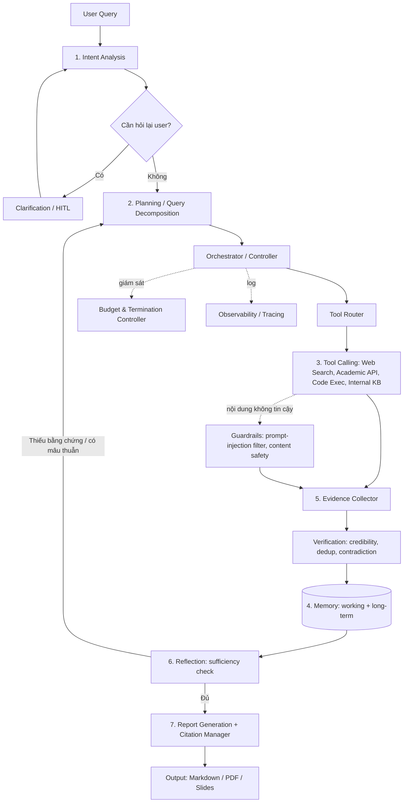

# Deep Research Agent — Review Kiến Trúc & Kế Hoạch Triển Khai

## 1. Đánh giá kiến trúc đề xuất

Bộ 7 thành phần bạn đưa ra:

| # | Thành phần | Vai trò | Đánh giá |
|---|---|---|---|
| 1 | Intent Analysis | Hiểu yêu cầu, phân loại loại nghiên cứu | Cần thiết, nhưng cần làm rõ output schema |
| 2 | Planning | Chia nhỏ câu hỏi thành sub-tasks | Cần thiết, nhưng thiếu cơ chế **re-planning** |
| 3 | Tool Calling | Gọi search/API/code execution | Cần thiết, nhưng thiếu **tool routing policy** |
| 4 | Memory | Lưu trạng thái | Cần thiết, nhưng thiếu phân tách working vs long-term |
| 5 | Evidence Collector | Thu thập bằng chứng | Cần thiết, nhưng thiếu verification/dedup/citation |
| 6 | Reflection | Tự phê bình, đánh giá đủ thông tin chưa | Cần thiết — đây là phần biến "RAG" thành "Deep Research" |
| 7 | Report Generation | Tổng hợp báo cáo cuối | Cần thiết, nhưng thiếu citation mapping & format đa dạng |

**Kết luận: 7 thành phần trên là bộ khung đúng nhưng CHƯA ĐỦ.** Chúng mô tả đúng "vòng lặp tư duy" (think–act–observe–reflect) nhưng thiếu 3 nhóm:
- **Nhóm điều phối** (ai gọi ai, khi nào dừng, khi nào lặp lại)
- **Nhóm chất lượng & tin cậy bằng chứng** (verification, dedup, contradiction detection, citation)
- **Nhóm vận hành/an toàn** (guardrails, observability, cost control, evaluation)

Một Deep Research Agent thực sự (kiểu Claude Research / OpenAI Deep Research / Perplexity) luôn có các phần này ẩn phía sau — nếu bỏ qua, hệ thống sẽ dừng ở mức "agentic RAG" chứ chưa phải "deep research".

---

## 2. Kiến trúc đầy đủ (bổ sung)

### 2.1 Sơ đồ tổng thể

### 2.2 Danh sách thành phần bổ sung (bắt buộc)

| Thành phần mới | Vì sao cần | Vị trí trong pipeline |
|---|---|---|
| **Orchestrator / Controller** | 7 thành phần gốc là các "khối chức năng", nhưng không có ai quyết định thứ tự gọi, khi nào lặp lại Planning→Tool→Reflection. Không có nó thì không có vòng lặp Deep Research thực sự. | Trung tâm, điều phối toàn bộ |
| **Query Decomposition** (tách khỏi Planning) | Planning thường bị hiểu là "lập kế hoạch hành động"; Decomposition là bước tạo **sub-questions** rõ ràng, có thể tách để test độc lập. | Sau Intent Analysis |
| **Tool Router / Selection Policy** | Có nhiều tool (web, academic DB, code exec, internal RAG) — cần chính sách chọn tool nào cho sub-question nào, tránh gọi search cho câu hỏi cần tính toán. | Trước Tool Calling |
| **Source Verification & Credibility Scoring** | Web search trả về thông tin sai lệch, quảng cáo, nguồn không đáng tin. Không verify → báo cáo sai. | Sau Evidence Collector |
| **Deduplication & Clustering** | Nhiều nguồn lặp lại cùng 1 fact → tốn token, gây báo cáo dài dòng, thiên vị theo tần suất xuất hiện thay vì độ tin cậy. | Sau Evidence Collector |
| **Citation / Attribution Manager** | Report Generation cần map từng claim → nguồn cụ thể để tránh hallucination và cho phép user kiểm chứng. | Trước Report Generation |
| **Iteration / Termination Controller** | Quyết định khi nào dừng nghiên cứu (đủ sâu, hết ngân sách token/thời gian, evidence đã bão hòa). Thiếu nó → vòng lặp vô hạn hoặc dừng quá sớm. | Gắn với Orchestrator |
| **Guardrails / Safety Layer** | Nội dung lấy từ web là **untrusted input** — có thể chứa prompt injection ("ignore previous instructions..."). Đây đúng là bài toán bạn đang làm ở project LLM Firewall, nên tái sử dụng được. | Giữa Tool Calling và Evidence Collector |
| **Human-in-the-loop / Clarification** | Khi câu hỏi mơ hồ hoặc phạm vi quá rộng, cần hỏi lại user thay vì đoán. | Sau Intent Analysis |
| **Observability & Tracing** | Debug agent loop nhiều bước rất khó nếu không log lại từng plan/tool-call/reflection. | Xuyên suốt |
| **Cost / Budget Manager** | Deep research có thể gọi hàng chục tool call — cần giới hạn token/API cost/thời gian mỗi phiên. | Gắn với Orchestrator |
| **Evaluation & Benchmarking Harness** | Không đo được thì không cải thiện được — cần bộ eval set + rubric (faithfulness, coverage, citation accuracy). | Ngoài pipeline, chạy offline |
| **Multi-agent Parallelization** (nâng cao) | Với câu hỏi rộng, chạy song song nhiều sub-agent cho từng sub-question giảm latency đáng kể (giống kiến trúc lead-agent/sub-agent của Claude). | Thay thế Tool Calling tuần tự ở giai đoạn nâng cao |
| **Output/Delivery Layer** | Report không chỉ là markdown — cần export PDF/slide, hoặc gửi qua webhook/email. | Sau Report Generation |

---

## 3. Kế hoạch triển khai theo giai đoạn

> Giả định: prototype ban đầu trên Google Colab (phù hợp với workflow hiện tại), chuyển sang service riêng từ Phase 7 trở đi.

### Phase 0 — Xác định phạm vi & chọn stack (~1 tuần)
- Xác định loại câu hỏi mục tiêu (business research / academic / competitive analysis / general web) — phạm vi ảnh hưởng đến tool cần tích hợp.
- Chọn stack:
  - LLM: **Google Gemini API** (sử dụng SDK `google-genai` mới nhất):
    - **Gemini Pro (1.5 Pro / 2.0 Pro)**: Dành cho Reasoning, Planning, Reflection, Contradiction Detection & Report Generation (tận dụng context window 1M-2M tokens, suy luận sâu, đọc PDF/ảnh trực tiếp).
    - **Gemini Flash (1.5 Flash / 2.0 Flash / Flash Lite)**: Dành cho các tác vụ nhanh và tối ưu chi phí (Intent Classification, Query Decomposition, Tool Routing, Deduplication, Verification).
    - **Tính năng nổi bật**: Tận dụng Structured Output (`response_schema`), Native Google Search Grounding làm phương án dự phòng/kết hợp.
  - Orchestration: LangGraph hoặc state machine tự viết bằng asyncio (khuyến nghị tự viết trước để hiểu rõ control flow, sau đó cân nhắc LangGraph khi cần checkpoint/resume)
  - Search API: Tavily hoặc Exa (tối ưu cho AI agent, trả kết quả sạch hơn Google raw) kết hợp Google Search Grounding của Gemini.
  - Academic: Semantic Scholar API, arXiv API
  - Vector DB: Chroma (prototype) → Qdrant (khi cần production)
  - Tracing: Langfuse hoặc Arize Phoenix (self-host được, không lệ thuộc vendor)
- Deliverable: tài liệu kiến trúc (bản này) + repo skeleton + `.env` config (`GEMINI_API_KEY`,...).

### Phase 1 — MVP: pipeline một lượt, một tool (~2 tuần)
- Intent Analysis: LLM call phân loại loại câu hỏi + trích constraints (thời gian, phạm vi, định dạng output mong muốn).
- Query Decomposition: tách thành 3-5 sub-questions (single-shot, chưa lặp).
- Tool Calling: chỉ tích hợp 1 tool — web search — theo vòng ReAct đơn giản (Thought → Action → Observation).
- Evidence Collector: lưu schema tối thiểu `{claim, source_url, snippet, sub_question_id}`.
- Report Generation: tổng hợp thẳng, chưa có citation chuẩn.
- **Bỏ qua Memory và Reflection ở phase này** — mục tiêu là chứng minh pipeline end-to-end chạy được.
- Deliverable: demo trả lời được 1 câu hỏi nghiên cứu đơn giản, có log toàn bộ trace.

### Phase 2 — Chất lượng bằng chứng & Citation (~2 tuần)
- Evidence schema mở rộng: thêm `confidence_score`, `retrieved_at`, `source_type`.
- Source Verification: chấm điểm domain (whitelist nguồn uy tín, penalize nguồn không rõ tác giả/ngày tháng), kiểm tra độ mới.
- Deduplication: embedding similarity (cosine > ngưỡng) để gộp các claim trùng lặp từ nhiều nguồn.
- Citation Manager: mỗi câu trong report map ngược về `evidence_id` → sinh footnote/link tự động.
- Deliverable: report có trích dẫn từng claim, review tỷ lệ claim có nguồn hợp lệ.

### Phase 3 — Planning động & đa tool (~2-3 tuần)
- Nâng Planning từ single-shot lên **Plan → Execute → Replan** (Plan-and-Execute pattern).
- Tool Router: policy chọn tool theo loại sub-question (web search / academic API / code execution cho tính toán / internal RAG nếu có tài liệu nội bộ).
- Thêm tool: Semantic Scholar/arXiv, code sandbox (cho câu hỏi cần tính toán/số liệu).
- Iteration/Termination Controller: giới hạn max-depth, max tool-calls, hoặc "diminishing returns" (dừng khi 2 vòng liên tiếp không thêm evidence mới).
- Deliverable: agent xử lý được câu hỏi multi-hop cần nhiều loại nguồn.

### Phase 4 — Reflection thực sự (core của "Deep Research") (~2 tuần)
- Sau mỗi vòng thu thập: LLM tự phê bình — evidence có mâu thuẫn không? còn góc nhìn nào chưa cover? câu trả lời hiện tại có đủ sâu không?
- Contradiction detection: so sánh các claim cùng chủ đề từ nguồn khác nhau, gắn cờ khi mâu thuẫn.
- Sufficiency check: LLM-judged điểm "đã đủ để viết report tốt chưa" → nếu chưa, sinh thêm sub-questions và quay lại Planning.
- Đây là bước biến pipeline từ "RAG một lượt" thành "deep research lặp".
- Deliverable: đo được số vòng reflection trung bình, và mức tăng chất lượng report qua từng vòng lặp (so sánh 1-pass vs multi-pass).

### Phase 5 — Memory (working + long-term) (~2 tuần)
- Working memory: quản lý context window trong 1 phiên (nén/summarize evidence cũ khi vượt token budget, giữ nguyên plan hiện tại + evidence mới nhất).
- Long-term memory: vector store lưu các report/finding đã có, để lần sau không research lại từ đầu (cache theo semantic similarity của câu hỏi, không chỉ theo exact match).
- User preference memory: định dạng report ưa thích, domain hay hỏi (tùy chọn).
- Deliverable: câu hỏi follow-up hoặc câu hỏi tương tự trước đó không phải chạy lại toàn bộ pipeline.

### Phase 6 — Guardrails & An toàn (~1-2 tuần)
- Toàn bộ nội dung lấy từ Tool Calling (đặc biệt web) được coi là **untrusted input** trước khi vào context — áp dụng lớp phòng thủ prompt injection (tái dùng thiết kế từ project LLM Firewall của bạn: pattern detection + sandwich/delimiter defense + LLM-based classifier cho nội dung nghi ngờ).
- Content safety filter (nội dung độc hại, bản quyền), PII redaction trước khi lưu memory.
- Rate limit / cost cap theo session.
- Deliverable: bộ test case "trang web độc hại chứa injection" và verify agent không bị chi phối.

### Phase 7 — Multi-agent parallelization (nâng cao, ~2-3 tuần)
- Lead agent tách sub-questions cho nhiều sub-agent chạy song song (mỗi sub-agent có tool access + evidence collector riêng).
- Aggregator gộp kết quả, xử lý xung đột giữa các sub-agent.
- Đo trade-off: giảm latency đáng kể nhưng tăng cost (nhiều LLM call song song) — cần Budget Manager kiểm soát chặt hơn.
- Deliverable: benchmark latency/cost giữa sequential vs parallel cho cùng một tập câu hỏi.

### Phase 8 — Evaluation & Benchmarking (~2 tuần, sau đó chạy liên tục)
- Xây bộ eval 30-50 câu hỏi nghiên cứu thực tế kèm rubric.
- Metrics: factual accuracy, citation precision/recall, coverage/depth, coherence, latency, cost/report.
- Kết hợp LLM-as-judge (tự động) + human spot-check định kỳ.
- Deliverable: eval harness chạy được trong CI, có baseline scorecard để so sánh khi thay đổi prompt/model.

### Phase 9 — Report Generation & Delivery (~1-2 tuần)
- Đa dạng hóa output: markdown đầy đủ, executive summary ngắn, PDF, slide deck (có thể tận dụng lại pipeline tạo pptx nếu cần).
- Template theo domain (academic report khác business report khác technical deep-dive).
- Kênh delivery: webhook, email, API endpoint trả JSON + report.
- Deliverable: 1 report có thể xuất ra ít nhất 2 định dạng khác nhau từ cùng 1 dữ liệu evidence.

### Phase 10 — Productionization (~2 tuần)
- Observability đầy đủ (dashboard chi phí, latency, tỷ lệ lỗi tool call).
- Caching layer cho search/tool call lặp lại.
- Retry/error handling cho tool không ổn định (timeout, rate limit từ search API).
- Chuyển từ Colab sang service (container hóa, deploy API), giữ Colab cho experimentation.
- Deliverable: hệ thống chạy ổn định ngoài môi trường notebook.

---

## 4. Lưu ý liên quan đến các project khác của bạn

- **LLM Firewall**: nên thiết kế Guardrails Layer (Phase 6) tương thích để tái sử dụng logic phát hiện prompt injection — đây chính là input untrusted (nội dung web) mà firewall của bạn đang giải quyết.
- **Context Assembler**: nếu project đó tập trung vào retrieval/ranking/compression/token budgeting, có thể dùng trực tiếp làm module cho Working Memory (Phase 5) và Tool Router (Phase 3) thay vì xây lại từ đầu.
